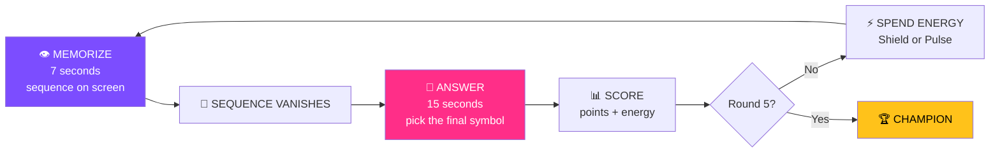
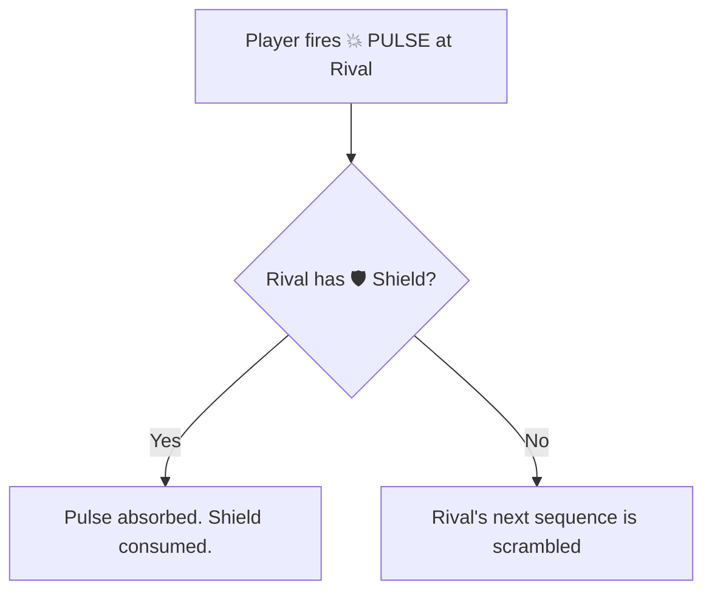
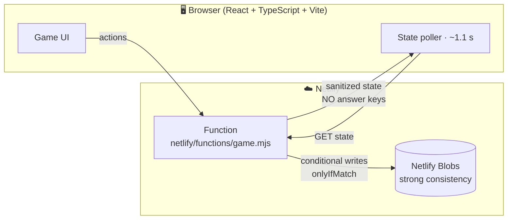

<div align="center">

```
███████╗ ██████╗██╗  ██╗ ██████╗     ███████╗██╗  ██╗██╗███████╗████████╗
██╔════╝██╔════╝██║  ██║██╔═══██╗    ██╔════╝██║  ██║██║██╔════╝╚══██╔══╝
█████╗  ██║     ███████║██║   ██║    ███████╗███████║██║█████╗     ██║
██╔══╝  ██║     ██╔══██║██║   ██║    ╚════██║██╔══██║██║██╔══╝     ██║
███████╗╚██████╗██║  ██║╚██████╔╝    ███████║██║  ██║██║██║        ██║
╚══════╝ ╚═════╝╚═╝  ╚═╝ ╚═════╝     ╚══════╝╚═╝  ╚═╝╚═╝╚═╝        ╚═╝
```

### ⚡ A memory duel. A strategy war. 22 seconds a round. ⚡

**Remember the pattern. Claim the final symbol. Charge your energy. Scramble your rivals' minds.**


**No accounts. No downloads. No API keys. No database setup.**
**Share a six-character code — and the arena opens.**

</div>

---

## 🧠 The Idea

Most party games test **speed**. Most memory games test **recall**. Most strategy games test **planning**.

**ECHO SHIFT forces all three into the same 22 seconds.**

You glimpse a symbol sequence for **7 seconds**. It vanishes. You have **15 seconds** to choose its final symbol — while rivals race you for first-blood bonuses, and every correct answer charges the energy you'll use to **shield yourself** or **scramble a rival's next sequence**.

Remembering is not enough. You have to remember **faster than everyone else**, and decide **who to sabotage**.

> One person built the entire thing from scratch — client, server, rules engine, and concurrency layer.

---

## 🎬 A Round, Frame by Frame



---

## ⚔️ Abilities

You earn **1 energy charge per correct answer** (max **3**). Spend them wisely.

| Ability | Cost | Effect |
|---|---|---|
| 🛡️ **SHIELD** | 1 energy | Blocks the **next incoming Pulse** aimed at you |
| 💥 **PULSE** | 1 energy | **Scrambles a rival's next sequence** |



Hoard energy for a late-game strike — or burn it early to cripple the leader. Max three charges means hoarding has a ceiling.

---

## 💯 Scoring

| Event | Points |
|---|---|
| ✅ Correct answer | **+100** |
| 🥇 First correct answer of the round | **+25** |
| ⚡ Correct answer within 3 seconds | **+10** |
| 🔋 Any correct answer | **+1 energy** (cap 3) |

**Perfect round = 135 points. Perfect game = 675.**

### Tiebreakers (in order)

1. Highest score
2. Most correct answers
3. Lowest cumulative response time

No ties survive. Someone is always faster.

---

## 🏗️ Architecture



### 🔐 Server-authoritative by design

The client **never receives an answer key**. The server validates the chosen answer index and computes every score. Opening DevTools reveals nothing worth cheating with.

### 🔒 Concurrency without a database

Eight players can hit one room at the same moment. Room state lives as a single JSON object in a strongly consistent Blobs store, protected by:

- a **short-lived per-room lock** created via conditional writes
- **`onlyIfMatch`** commits, so a stale write fails instead of overwriting

A deliberate best-effort guard for a lightweight real-time prototype — see [Limitations](#-honest-limitations).

---

## 🚀 Quick Start

**Requirements:** Node.js 20+ recommended.

```bash
npm install
npm run dev
```

> **Heads-up:** plain Vite serves only the frontend. The client calls `/.netlify/functions/game`, which Vite does not emulate. For the full game locally, install the Netlify CLI and run:
>
> ```bash
> netlify dev
> ```

### Test & build

```bash
npm test          # contract test suite
npm run build     # production build
```

---

## 🌍 Deploy

1. Verify locally: `npm install` then `npm run build`.
2. Deploy via **Netlify Git-based deployment** (recommended), **Netlify CLI**, or a ZIP to Netlify Drop.
   *Drop's serverless function support can vary by workflow. If the function isn't recognized from a ZIP, use Git or CLI.*
3. Confirm `/.netlify/functions/game` is live and Blobs is available to Functions.
4. Open the public URL in **two separate browser sessions**, create a room, join with the six-character code, and play five rounds.

No GitHub account is required by the code. A Netlify account is required to publish a public URL. **Never put private tokens in frontend code.**

---

## 🎮 Play in 60 Seconds

| Step | Who | Action |
|---|---|---|
| 1 | Host | Create a room → get a **6-character code** |
| 2 | Friends | Enter the code to join (2–8 players total) |
| 3 | Host | Start once **2+ players** are in |
| 4 | Everyone | Memorize → answer → score → ability → repeat |
| 5 | Everyone | After **round 5**, the highest score is champion |

---

## 🧪 Honest Limitations

This README does not pretend to be more than it is.

| Limitation | Detail |
|---|---|
| 🔄 **Polling, not WebSockets** | Clients poll roughly every 1.1 seconds |
| 🧱 **Not a transactional DB** | The lock + `onlyIfMatch` approach is a best-effort concurrency guard |
| 🏟️ **Not tournament-grade** | For high-concurrency competitive play, migrate room state to a transactional database and add WebSockets or a presence service |

### Build verification status

The source syntax checks and the included **3-test contract suite pass**. A full Vite production build and lockfile generation could not be run in the original generation environment because `registry.npmjs.org` failed with DNS `EAI_AGAIN`. The archive is **source-complete but not verified as a production build**, and intentionally ships **no fabricated lockfile**.

On a network-enabled runner:

```bash
npm install     # resolves deps, creates package-lock.json
npm run build
```

---

## 🗺️ Where This Could Go

- ⚡ WebSocket transport for true real-time sync
- 🗄️ Transactional backend for competitive-grade integrity
- 🧩 Longer sequences and new symbol sets as rounds escalate
- 📡 Presence indicators and reconnect handling

---

<div align="center">

### Designed, coded, and shipped by one developer. ⚡

**Gather your friends. Open a room. Find out who really remembers.**

`ECHO SHIFT`

</div>
