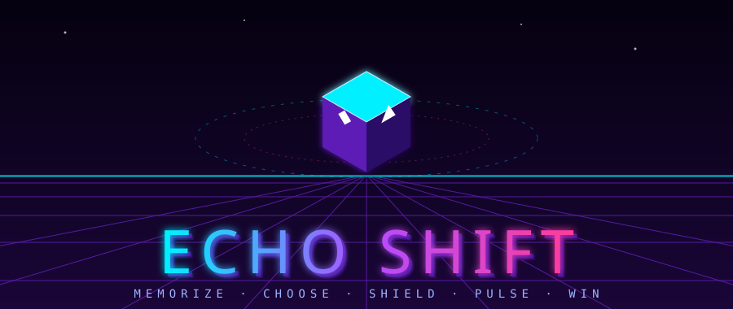
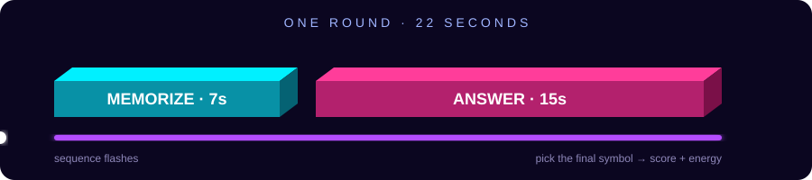
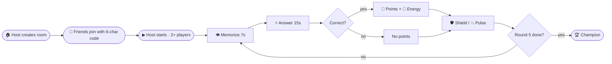
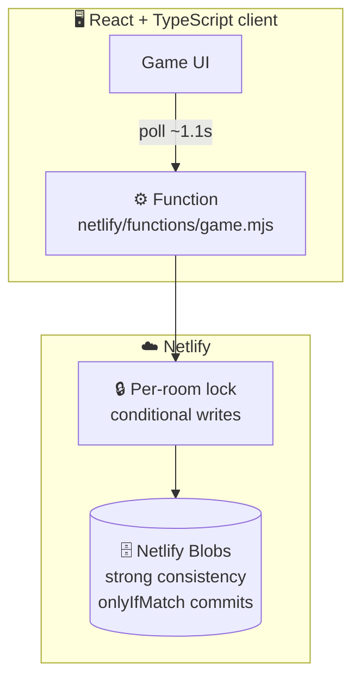

<div align="center">



### ⚡ A real-time memory-and-sabotage arena for 2–8 players ⚡


**Built from scratch by one developer. No database setup. No API keys. Just a room code and your friends.**

</div>

---

## 🌀 The Idea

> A sequence of symbols flashes. It vanishes. **Remember it, choose its final symbol, and strike your rivals before they strike you.**

Echo Shift fuses a memory race with a tactical power system. Fast, correct answers fill your energy; energy becomes a **Shield** or a **Pulse** that scrambles an opponent's next sequence. Five rounds. One champion.



---

## 🎮 How a Match Flows



---

## 🧮 Scoring Engine

| Action | Reward |
|:--|:--:|
| ✅ Correct answer | **+100** |
| 🥇 First correct in the round | **+25** |
| ⚡ Correct within 3 seconds | **+10** |
| 🔋 Any correct answer | **+1 energy** (max 3) |

> 🔥 **Perfect round: 135 points** (100 + 25 + 10).

### ⚔️ Abilities

| | Ability | Cost | Effect |
|:-:|:--|:-:|:--|
| 🛡 | **Shield** | 1 energy | Blocks the next incoming Pulse |
| 💥 | **Pulse** | 1 energy | Scrambles a rival's next sequence |

### 🏆 Tiebreakers (in order)
1. Highest score
2. Most correct answers
3. Fastest cumulative response time

---

## 🚀 Quick Start

**Requirements:** Node.js 20+ recommended

```bash
npm install
npm run dev
```

> ⚠️ Vite alone serves only the frontend. For the serverless game function, install the Netlify CLI and run:
> ```bash
> netlify dev
> ```
> The client talks to `/.netlify/functions/game` directly.

```bash
npm test         # contract test suite
npm run build    # production build
```

---

## 🌐 Deploy to Netlify

1. Run `npm install && npm run build` locally to verify.
2. Deploy via **Git-connected deploy** (recommended) or the Netlify CLI. A manual ZIP on Netlify Drop may not register the function.
3. Confirm `/.netlify/functions/game` is live and Netlify Blobs is available.
4. Open the URL in **two separate browser sessions**, create a room, join with the code, and play five rounds.

> 🔐 Never put private tokens in frontend code.

---

## 🧱 Architecture



<details>
<summary><b>🛡 Anti-cheat by design</b></summary>

The server **never sends answer keys** to clients. It validates the chosen answer index and computes all scores itself.
</details>

<details>
<summary><b>⚠️ Known limitations (honest section)</b></summary>

- Room state is one JSON object in a strongly consistent Blobs store, protected by a short-lived lock plus `onlyIfMatch` commits. This is a **best-effort concurrency guard** for a party-game prototype, not transactional database semantics.
- The frontend **polls** (~1.1s); it is not WebSocket-based.
- For high-concurrency or competitive production play: move mutable room state to a transactional database and add WebSockets/presence.
</details>

<details>
<summary><b>🧪 Build verification status</b></summary>

Source syntax checks and the included 3-test contract suite pass. A full Vite production build and lockfile generation could not run in the generation environment (`registry.npmjs.org` DNS `EAI_AGAIN`). The archive is **source-complete but not verified as a production build**. On a network-enabled runner, run `npm install` (creates `package-lock.json`) then `npm run build`. No fabricated lockfile is included.
</details>

---

## 🗺 Roadmap

- [ ] WebSocket realtime sync
- [ ] Transactional database for competitive play
- [ ] More symbol sets and Pulse variants

---

<div align="center">

**Made solo, from zero, with obsession.** 🔮

⭐ *Star the repo if Echo Shift made you lose a round you were sure you'd win.* ⭐

</div>
